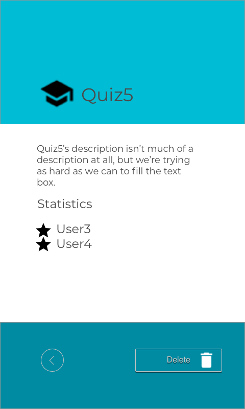

# QuizUIDesign
Design a Quiz App that allows players to create quizzes with words and play quizzes others made.
Design was done in Sketch, interface eventually implemented in Android's Layout Editor.

